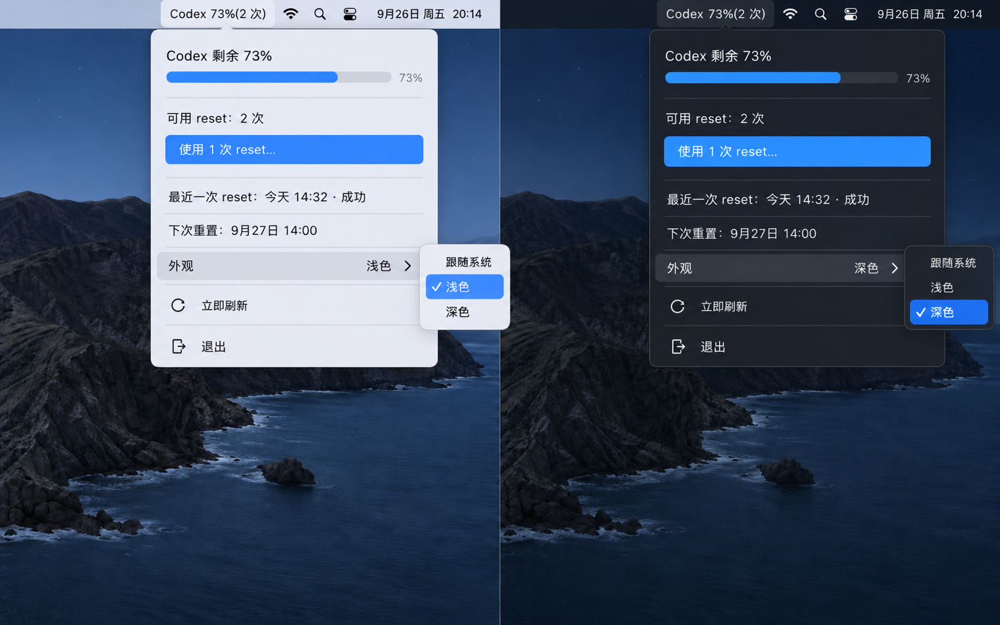

<div align="center">

# Codex Usage

**Codex usage and banked resets, right in your macOS menu bar.**

**把 Codex 剩余用量和可用 reset，直接放进 macOS 状态栏。**

[](#requirements)
[](#development-status)
[](#development-status)

[English](#english) · [简体中文](#简体中文)



<sub>Design target — implementation is in progress. / 设计目标图——程序正在实现中。</sub>

</div>

---

## English

### About

Codex Usage is a lightweight, native macOS menu bar utility for checking your remaining Codex allowance without opening a dashboard. When your account has banked resets, the available count appears beside the percentage and you can redeem one from the popover after a confirmation.

The status title stays deliberately compact:

```text
Codex 100%             No reset available
Codex 73% (2 resets)  Two resets available
```

### Target experience

- Primary Codex allowance with a compact horizontal progress bar.
- Reset count shown only when one or more resets are available.
- Clear “no reset available” state when the count is zero.
- Confirm-before-redeem reset action with idempotent retry protection.
- Most recent reset time and outcome stored locally.
- Automatic refresh on launch, every 60 seconds, and when the popover opens.
- Follow System, Light, and Dark appearances.
- Follow System, English, and Simplified Chinese languages.
- No Dock icon and no full application window.

### Privacy and safety

- Uses the official local Codex App Server and your existing Codex sign-in.
- Does not read, copy, or persist ChatGPT access tokens.
- Communicates with a local child process over pipes; it does not open a listening network port.
- Never redeems a reset automatically.
- Automated tests never consume a real reset.

### Development status

This repository is under active development. The product design and protocol path are validated; the native app, packaging, and end-to-end verification are still being completed. There is no downloadable release yet.

Build and installation instructions will be added once the first runnable `.app` passes the full verification checklist.

### Requirements

- macOS 13 or later.
- Apple Silicon or Intel Mac supported by the final Swift build.
- Codex CLI or the ChatGPT/Codex desktop app installed.
- A ChatGPT account already signed in to Codex.

### Documentation

- [Product design and technical specification](docs/superpowers/specs/2026-09-20-codex-usage-menubar-design.md)

---

## 简体中文

### 项目简介

Codex Usage 是一个轻量、原生的 macOS 状态栏工具。不用打开设置或用量页面，就能直接查看 Codex 剩余用量。账户存在可用 reset 时，状态栏会显示数量；点击后可在弹窗确认并使用一次 reset。

状态栏标题保持尽量短：

```text
Codex 100%         当前没有可用 reset
Codex 73%(2 次)   当前有 2 次可用 reset
```

### 目标功能

- 使用紧凑的横向进度条展示主 Codex 配额。
- 仅在 reset 数量大于零时显示次数。
- reset 为零时明确显示“当前没有可用 reset”。
- 使用 reset 前必须确认，并通过幂等重试避免重复消费。
- 在本机保存最近一次 reset 的时间和结果。
- 启动时、每 60 秒以及打开弹窗时自动刷新。
- 支持跟随系统、浅色和深色外观。
- 支持跟随系统、English 和简体中文界面。
- 不显示 Dock 图标，也不提供多余的主窗口。

### 隐私与安全

- 使用官方本地 Codex App Server 和已有的 Codex 登录状态。
- 不读取、不复制、不保存 ChatGPT Token。
- 仅通过本机管道与子进程通信，不开放网络监听端口。
- 永远不会自动使用 reset。
- 自动化测试不会消费真实 reset。

### 开发状态

项目正在开发中。目前已经确认产品设计和协议方案；原生 App、打包及端到端验证仍在完成。当前还没有可下载的正式版本。

首个可运行 `.app` 完整通过验证后，会补充构建和安装说明。

### 环境要求

- macOS 13 或更高版本。
- 最终 Swift 构建支持的 Apple Silicon 或 Intel Mac。
- 已安装 Codex CLI 或 ChatGPT/Codex 桌面 App。
- ChatGPT 账户已经登录 Codex。

### 项目文档

- [产品设计与技术规格](docs/superpowers/specs/2026-09-20-codex-usage-menubar-design.md)
