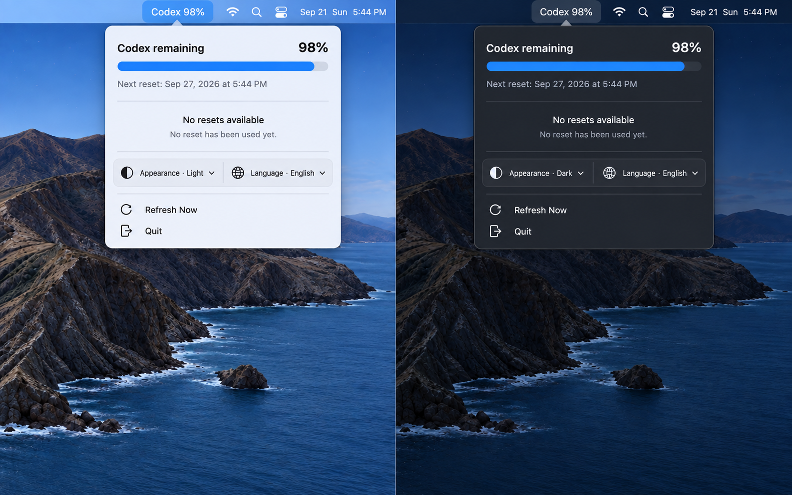

<div align="center">

# Codex Usage

**把 Codex 剩余用量和可用 reset，直接放进 macOS 状态栏。**

[](#环境要求)
[](#构建与运行)
[](#构建与运行)
[](LICENSE)

[English README](README.md)



<sub>已选定的紧凑型浅色与深色设计。</sub>

</div>

---

### 项目简介

Codex Usage 是一个轻量、原生的 macOS 状态栏工具。不用打开设置或用量页面，就能直接查看 Codex 剩余用量。账户存在可用 reset 时，状态栏会显示数量；点击后可在弹窗确认并使用一次 reset。

状态栏标题保持尽量短：

```text
Codex 100%         当前没有可用 reset
Codex 73%(2 次)   当前有 2 次可用 reset
```

### 目标功能

- 使用紧凑的横向进度条展示主 Codex 配额。
- 仅在 reset 数量大于零时显示次数。
- reset 为零时明确显示“当前没有可用 reset”。
- 使用 reset 前必须确认，并通过幂等重试避免重复消费。
- 在本机保存最近一次 reset 的时间和结果。
- 启动时、每 60 秒以及打开弹窗时自动刷新。
- 支持浅色和深色外观。
- 支持 English 和简体中文界面，默认使用 English。
- 不显示 Dock 图标，也不提供多余的主窗口。

### 隐私与安全

- 使用官方本地 Codex App Server 和已有的 Codex 登录状态。
- 不读取、不复制、不保存 ChatGPT Token。
- 仅通过本机管道与子进程通信，不开放网络监听端口。
- 永远不会自动使用 reset。
- 自动化测试不会消费真实 reset。

### 构建与运行

使用 Apple Command Line Tools 即可构建，不要求安装完整 Xcode。在仓库根目录运行：

```bash
scripts/test.sh
scripts/build-app.sh
open dist/CodexUsage.app
```

`scripts/build-app.sh` 会在 `dist/CodexUsage.app` 生成经过 ad-hoc 签名的本机版本。若要分发给其他 Mac，还需要 Developer ID 签名和公证。

### 环境要求

- macOS 13 或更高版本。
- 最终 Swift 构建支持的 Apple Silicon 或 Intel Mac。
- 已安装 Codex CLI 或 ChatGPT/Codex 桌面 App。
- ChatGPT 账户已经登录 Codex。

### 开源协议

本项目采用 [MIT License](LICENSE)。你可以自由使用、修改、再分发，也可以用于商业项目；再发布时保留版权声明和许可文本即可。

### 项目文档

- [产品设计与技术规格](docs/superpowers/specs/2026-09-20-codex-usage-menubar-design.md)
