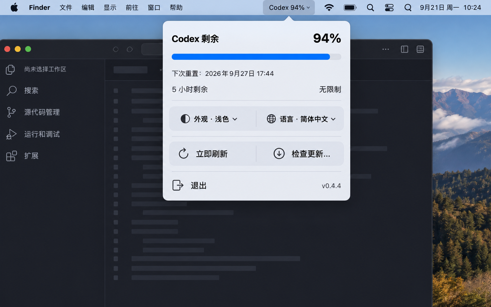

<div align="center">

# Codex Usage

**把 Codex 多周期剩余用量和可用 reset 次数，直接放进 macOS 状态栏。**

[](#环境要求)
[](#构建与运行)
[](#构建与运行)
[](LICENSE)

[English README](README.md)

[**下载最新版本**](https://github.com/hinson0/codex-usage/releases/latest)



<sub>已选定的紧凑型浅色与深色设计。</sub>

</div>

---

### 项目简介

Codex Usage 是一个轻量、原生的 macOS 状态栏工具。不用打开设置或用量页面，就能直接查看 Codex 剩余用量。App 会读取官方返回的 5 小时与长周期窗口；可用 reset 只显示次数，不提供兑换，也不保存操作历史。

状态栏标题保持尽量短：

```text
Codex 99%             只有本周额度，5 小时无限制
Codex 82%-94%         依次为 5 小时、本周剩余
Codex 82%-94%(2 次)  当前有 2 次可用 reset
```

### 目标功能

- 同时存在限制时，显示 5 小时与本周剩余百分比。
- 官方未返回 5 小时窗口时，明确显示“无限制”。
- 使用紧凑的横向进度条展示本周额度和重置时间。
- reset 只读显示次数，并且仅在数量大于零时出现。
- 启动时、每 60 秒以及打开弹窗时自动刷新。
- 支持浅色和深色外观。
- 支持 English 和简体中文界面，默认使用 English。
- 提供双语“检查更新…”入口，并通过 Sparkle 定时检查新版本。
- 不显示 Dock 图标，也不提供多余的主窗口。

### 下载与更新

每个 GitHub Release 都提供两种安装包：

- `CodexUsage-vX.Y.Z-macOS.dmg` 给人手动安装，打开后拖进“应用程序”即可。
- `CodexUsage-vX.Y.Z-macOS.zip` 是 Sparkle 在 App 内更新时使用的同一份签名归档。

Release 还会附带 `SHA256SUMS` 和签名后的 `appcast.xml` 更新源。`0.4.3`
是首个支持 Sparkle 的版本，需要先手动安装；后续版本可通过“检查更新…”或后台
定时检查发现，并且不会静默强制安装。

### 隐私与安全

- 使用官方本地 Codex App Server 和已有的 Codex 登录状态。
- 不读取、不复制、不保存 ChatGPT Token。
- 不消费 reset，也不保存 reset 尝试历史。
- 仅通过本机管道与子进程通信，不开放网络监听端口。
- 自动化验证完全只读，不会消费真实 reset。

### 构建与运行

使用 Apple Command Line Tools 即可构建，不要求安装完整 Xcode。在仓库根目录运行：

```bash
scripts/test.sh
scripts/build-app.sh
open dist/CodexUsage.app
```

`scripts/build-app.sh` 会在 `dist/CodexUsage.app` 生成经过 ad-hoc 签名的本机版本。
公开 DMG 目前同样是 ad-hoc 签名，因此首次启动仍可能遇到 Gatekeeper 提示。DMG
只是安装得更体面；要正规消除提示，仍需 Developer ID 签名和 Apple 公证。

### 环境要求

- macOS 13 或更高版本。
- 最终 Swift 构建支持的 Apple Silicon 或 Intel Mac。
- 已安装 Codex CLI 或 ChatGPT/Codex 桌面 App。
- ChatGPT 账户已经登录 Codex。

### 开源协议

本项目采用 [MIT License](LICENSE)。你可以自由使用、修改、再分发，也可以用于商业项目；再发布时保留版权声明和许可文本即可。

### 项目文档

- [设计验收记录](design-qa.md)
